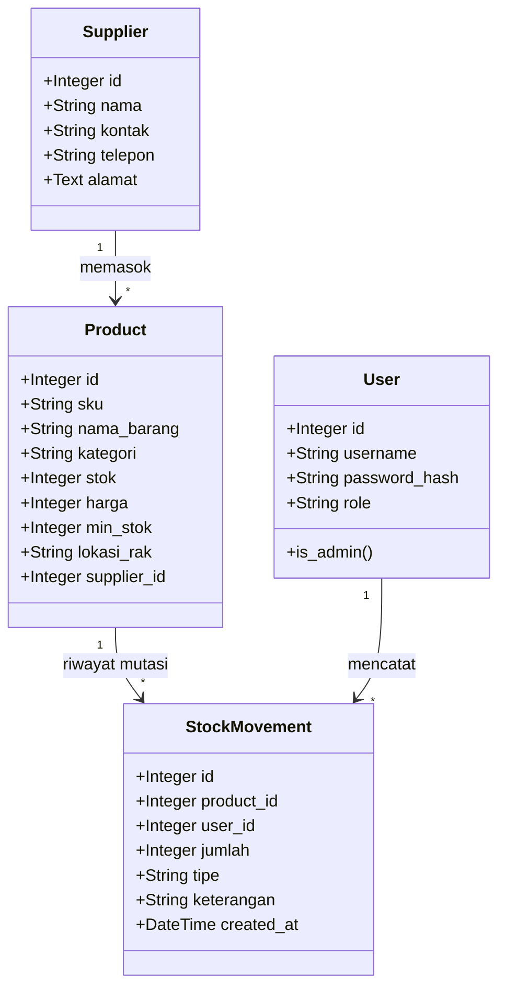

<div align="center">
  
  
  # 🌌 ZenithStock Enterprise
  
  ### *Platform Manajemen Inventaris & Logistik Gudang Modern Berbasis Cybertech*
  
  ---
  
  [](#)
  [](#)
  [](#)
  [](#)
  [](#)
  
  *Sistem pergudangan cerdas dengan integrasi Audit Trail otomatis, Otorisasi Akses RBAC, dan visualisasi diagram real-time.*
  
</div>

━━━━━━━━━━━━━━━━ 🌟 💠 🌟 ━━━━━━━━━━━━━━━━

## 📖 Analisis Kasus & Penjelasan Umum

Dalam industri manufaktur modern, integrasi data logistik adalah pilar utama efisiensi. **ZenithStock Enterprise** dikembangkan untuk mereduksi kendala-kendala pergudangan konvensional melalui rekayasa sistem otomatis:

* **Sistem Audit Log yang Tangguh:** Setiap mutasi stok barang (masuk, keluar, koreksi) dicatat secara otomatis dan bersifat *immutable* (tidak dapat diubah) untuk mencegah kecurangan (*fraud*).
* **Validasi Integritas SKU:** Sistem secara aktif menyaring kode SKU unik untuk memotong risiko duplikasi barang ganda di gudang.
* **Kontrol Akses Berbasis Otoritas (RBAC):** Membagi wewenang fungsional secara ketat antara Administrator (akses kontrol penuh) dan Staff Gudang (akses entry data operasional).
* **Valuasi Aset Real-Time:** Menghitung nilai total aset secara dinamis (Kuantitas × Harga Beli) untuk menyajikan laporan kesehatan finansial gudang secara instan.

━━━━━━━━━━━━━━━━ 🌟 💠 🌟 ━━━━━━━━━━━━━━━━

## 🛠️ Arsitektur & Struktur Folder Project

Aplikasi ini dirancang dengan struktur modular berbasis **Blueprints** untuk kemudahan pemeliharaan dan skalabilitas tinggi.

| Berkas / Direktori | Tipe | Fungsi & Penjelasan Peran dalam Sistem |
| :--- | :---: | :--- |
| `app.py` | 📄 File | Entry point utama aplikasi yang memanggil factory pattern dan menjalankan server web Flask lokal. |
| `seed_all.py` | 📄 File | Script data seeder untuk menginisialisasi database dengan data barang, supplier, dan log transaksi realistis. |
| `requirements.txt` | 📄 File | Daftar dependensi modul Python pendukung (Flask, SQLAlchemy, WTForms, dll). |
| `zenithstock/models.py` | 📄 File | Layer Data (OOP): Berisi deklarasi kelas ORM SQLAlchemy untuk memetakan tabel database relasional. |
| `zenithstock/forms.py` | 📄 File | Layer Validasi: Berisi deklarasi kelas WTForms untuk penyaringan input dan token CSRF. |
| `zenithstock/routes/` | 📁 Folder | Layer Controller: Kumpulan modul routing Flask Blueprint yang menangani logika bisnis. |
| `zenithstock/templates/` | 📁 Folder | Layer View: Berbasis Jinja2 template untuk menyajikan halaman antarmuka pengguna (UI). |
| `zenithstock/static/` | 📁 Folder | Aset Statis: Berisi master stylesheet kustom (`style.css`), berkas logo, dan background. |
| `instance/zenithstock.db` | 💾 File | Berkas database SQLite lokal penyimpan record data pergudangan terintegrasi. |

━━━━━━━━━━━━━━━━ 🌟 💠 🌟 ━━━━━━━━━━━━━━━━

## 💎 Penjelasan Detail Implementasi Sistem

ZenithStock Enterprise dibangun di atas pilar-pilar pemrograman web terkemuka:

### 🌐 Routing Blueprint Flask
Sistem rute dipisahkan secara modular untuk menjamin efisiensi kode:
* **Auth BP (`routes/auth.py`):** Mengelola beranda (`/`), otentikasi masuk (`/login`), register (`/register`), dan keluar (`/logout`).
* **Dashboard BP (`routes/dashboard.py`):** Mengelola inventaris barang utama (`/dashboard`) dan formulir CRUD barang.
* **Movements BP (`routes/movements.py`):** Mengelola pencatatan transaksi masuk, keluar, dan penyesuaian stok.
* **Suppliers BP (`routes/suppliers.py`):** Menangani CRUD database mitra pemasok (vendor).
* **Analytics BP (`routes/analytics.py`):** Memproses visualisasi data grafik analitik & diagram.
* **Audit BP (`routes/audit.py`):** Menyajikan data lembar pantau transaksi historis pergudangan.

> [!NOTE]
> Aplikasi memisahkan fungsionalitas HTTP Method: **GET** digunakan untuk mengambil & menampilkan data, sedangkan **POST** digunakan untuk memproses data formulir sensitif atau perubahan database secara aman.

---

### 🎨 Tampilan Dinamis (Template Engine Jinja2)
Penyusunan halaman antarmuka menerapkan prinsip **DRY (Don't Repeat Yourself)** melalui inheritance template Jinja2:
* **`base.html` sebagai Induk Layout:** Berisi menu sidebar dinamis, area notifikasi flash, impor library visual, dan header global. Halaman anak tinggal mewarisi struktur ini dengan memanggil ``.
* **Block System:** Konten spesifik halaman anak ditulis di dalam tag `` dan secara otomatis di-render ke dalam penampung template induk.
* **Kondisional & Loop Jinja:** Digunakan untuk memproses perulangan data baris tabel (``), memunculkan notifikasi kesalahan input (``), serta melakukan pemformatan harga mata uang Rupiah secara langsung.

---

### 🔒 Keamanan Formulir (Form Handling & Validation)
Penyaringan data input diimplementasikan dengan pertahanan 3 lapis untuk keamanan optimal:
* **Token CSRF Dinamis:** Setiap formulir dilengkapi token CSRF dari `Flask-WTF` untuk memverifikasi keaslian pengirim data.
* **Validasi Tipe & Batas Kritis:** Input angka (stok, harga, min_stok) disaring agar tidak dapat menerima input huruf atau angka negatif.
* **Validasi Keunikan Data:** Memastikan data penting seperti kode SKU produk tidak boleh kembar sebelum disimpan ke database.

---

### 💾 Relasi Data Objek (Database & SQLAlchemy ORM)
Pengelolaan database dikembangkan menggunakan basis **SQLAlchemy ORM** dengan model relasi terintegrasi:



#### Operasi CRUD & Mutasi Otomatis
* **Create (Tambah):** Menambahkan data barang baru. Mengisi stok awal saat pendaftaran barang otomatis memicu pembuatan log masuk (`MASUK`) di tabel `StockMovement` untuk menjaga integritas data awal.
* **Read (Baca):** Membaca daftar barang secara instan, dilengkapi live search dinamis dan filter kategori tanpa me-reload halaman (HTMX).
* **Update (Ubah):** Mengedit detail barang. Jika kuantitas stok diubah, sistem menghitung selisihnya dan mencatatnya sebagai tipe `PENYESUAIAN` di log audit trail secara otomatis.
* **Delete (Hapus):** Menghapus produk. Penghapusan data produk hanya diperkenankan untuk Admin dan otomatis menghapus seluruh transaksi mutasi terkait secara berantai (*cascade deletion*).

---

### 🛡️ Autentikasi & Otorisasi Hak Akses (RBAC)
* **Otentikasi (Authentication):**
  * Kredensial password dienkripsi menggunakan hash modern `pbkdf2:sha256` lewat modul `werkzeug.security`.
  * Status masuk login dikelola secara terpusat oleh `Flask-Login` via `login_user()`.
  * Pembatasan halaman non-login diimplementasikan menggunakan decorator `@login_required`.
* **Otorisasi / RBAC (Authorization):**
  * Akun dibagi menjadi peran **Administrator (Admin)** dan **Staff**.
  * Akun Staff dibatasi dari mengakses halaman log audit trail penuh dan manajemen pengguna. Upaya akses URL ilegal secara sengaja akan dihadang dan memicu HTTP **403 Forbidden**.

━━━━━━━━━━━━━━━━ 🌟 💠 🌟 ━━━━━━━━━━━━━━━━

## 🚀 Panduan Memulai Aplikasi

### 1. Instalasi Dependensi
Jalankan perintah berikut di terminal folder proyek untuk mengunduh modul:
```bash
pip install -r requirements.txt
```

### 2. Jalankan Seeding Data Uji Coba (Demo)
Jalankan seeder untuk mengisi database secara otomatis dengan simulasi transaksi pergudangan yang melimpah dan tren grafik yang rapi:
```bash
python seed_all.py
```

### 3. Jalankan Aplikasi
Mulai server Flask lokal:
```bash
python app.py
```
Akses sistem di browser Anda melalui alamat **[http://127.0.0.1:5000/](http://127.0.0.1:5000/)**.

━━━━━━━━━━━━━━━━ 🌟 💠 🌟 ━━━━━━━━━━━━━━━━

## 👥 Pengembang Utama (Developer)

Sistem informasi logistik ZenithStock Enterprise dirancang dan dikembangkan sepenuhnya oleh:

* **Developer:** Gempur Budi Anarki
