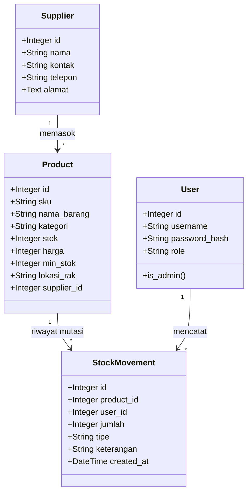

<div align="center">
  
  
  # 🌌 ZenithStock Enterprise
  
  ### *Platform Sistem Informasi Manajemen Logistik & Inventaris Barang Pergudangan Modern*
  
  ---
  
  [](#)
  [](#)
  [](#)
  [](#)
  [](#)
  
  *Sistem pergudangan cerdas dengan integrasi Audit Trail otomatis, Otorisasi Akses RBAC, dan visualisasi diagram real-time.*
  
</div>

━━━━━━━━━━━━━━━━ 🌟 💠 🌟 ━━━━━━━━━━━━━━━━

## 📖 Analisis Kasus & Penjelasan Umum

Dalam operasional rantai pasok (*supply chain*) gudang logistik skala besar, **pengendalian stok** adalah jantung operasional yang rawan terhadap inefisiensi dan kecurangan. ZenithStock Enterprise dirancang secara khusus untuk mengatasi masalah-masalah pergudangan kritis:

* **Pencegahan Penyusutan Barang (Asset Shrinkage):** Menghentikan kehilangan barang akibat tidak adanya pencatatan transaksi yang permanen dengan mengotomatisasi log mutasi yang bersifat *immutable* (tidak dapat diubah).
* **Validasi Integritas Kode Identitas (SKU):** Mencegah duplikasi data inventaris dengan filter validasi keunikan SKU (*Stock Keeping Unit*) di level form dan database.
* **Pembatasan Hak Otoritas:** Mencegah modifikasi data harga atau penghapusan barang oleh staff operasional melalui pembatasan akses berbasis peran (*Role-Based Access Control*).
* **Agregasi Nilai Aset Real-Time:** Memberikan informasi valuasi aset gudang yang akurat (Kuantitas × Harga Beli) secara instan melalui dashboard grafik analitik.

---

## 🛠️ Arsitektur & Struktur Folder Project

Aplikasi ini mengadopsi pola desain **MVC (Model-View-Controller)** yang modular menggunakan **Flask Blueprint** untuk memisahkan tanggung jawab kode program.

| Berkas / Direktori | Tipe | Fungsi & Penjelasan Peran dalam Sistem |
| :--- | :---: | :--- |
| `app.py` | 📄 File | Entry point utama aplikasi yang memanggil factory pattern dan menjalankan server web Flask lokal. |
| `seed_all.py` | 📄 File | Script data seeder untuk menginisialisasi database dengan data barang, supplier, dan log transaksi realistis. |
| `requirements.txt` | 📄 File | Daftar dependensi modul Python pendukung (Flask, SQLAlchemy, WTForms, dll). |
| `zenithstock/models.py` | 📄 File | Layer Data (OOP): Berisi deklarasi kelas ORM SQLAlchemy untuk memetakan tabel database relasional. |
| `zenithstock/forms.py` | 📄 File | Layer Validasi: Berisi deklarasi kelas WTForms untuk penyaringan input dan token CSRF. |
| `zenithstock/routes/` | 📁 Folder | Layer Controller: Kumpulan rute Flask Blueprint yang menangani logika bisnis. |
| `zenithstock/templates/` | 📁 Folder | Layer View: Berbasis Jinja2 template untuk menyajikan halaman antarmuka pengguna (UI). |
| `zenithstock/static/` | 📁 Folder | Aset Statis: Berisi master stylesheet kustom (`style.css`), berkas logo, dan background. |
| `instance/zenithstock.db` | 💾 File | Berkas database SQLite lokal penyimpan record data pergudangan terintegrasi. |

━━━━━━━━━━━━━━━━ 🌟 💠 🌟 ━━━━━━━━━━━━━━━━

## 💎 Penjelasan Detail Implementasi Sistem

ZenithStock Enterprise dibangun dengan arsitektur web modern yang mengintegrasikan berbagai aspek pemrograman web tingkat lanjut:

### 🌐 Routing Blueprint Flask
Sistem rute dipisahkan secara modular ke dalam beberapa Blueprint untuk memastikan kebersihan struktur kode. Blueprint dideklarasikan di file rute masing-masing dan diregistrasikan di file utama inisialisasi aplikasi (`zenithstock/__init__.py`).

```python
# Contoh registrasi Blueprint di zenithstock/__init__.py
from zenithstock.routes.auth import auth_bp
from zenithstock.routes.dashboard import dashboard_bp

app.register_blueprint(auth_bp)
app.register_blueprint(dashboard_bp)
```

Setiap rute mendefinisikan HTTP Methods yang didukung secara eksplisit:
* **GET:** Digunakan untuk memuat data dari database dan me-render halaman HTML (misalnya memuat tabel inventaris barang).
* **POST:** Digunakan untuk menerima data masukan dari pengguna untuk divalidasi dan disimpan ke database (misalnya menyimpan transaksi barang keluar).

---

### 🎨 Tampilan Dinamis (Template Engine Jinja2)
Penyusunan halaman antarmuka menerapkan prinsip **DRY (Don't Repeat Yourself)** melalui mekanisme pewarisan template Jinja2.

```html
<!-- Contoh pewarisan struktur dasar di child template -->


Inventaris Barang


<div class="zs-panel">
    <!-- Isi konten spesifik halaman diletakkan di sini -->
</div>

```
* **`base.html` sebagai Induk Layout:** Menyediakan struktur navigasi atas (topbar), menu sidebar dinamis, area notifikasi flash, impor pustaka visual, dan footer global.
* **Block System:** Konten spesifik halaman anak ditulis di dalam tag `` dan secara otomatis di-render ke dalam penampung template induk.
* **Kondisional & Loop Jinja:** Digunakan untuk merender baris data secara berulang (``), membedakan badge status stok (``), serta melakukan pemformatan harga mata uang Rupiah secara dinamis.

---

### 🔒 Keamanan Formulir (Form Handling & Validation)
Penyaringan data input diimplementasikan dengan pertahanan 3 lapis untuk keamanan optimal:
* **Proteksi Token CSRF:** Modul `Flask-WTF` secara otomatis menyematkan token CSRF terenkripsi pada setiap form untuk menangkal serangan *Cross-Site Request Forgery*.
* **WTForms Validation:** Validasi dilakukan di level backend python sebelum data diproses.

```python
# Contoh definisi form validasi di zenithstock/forms.py
from flask_wtf import FlaskForm
from wtforms import StringField, IntegerField
from wtforms.validators import DataRequired, NumberRange

class ProductForm(FlaskForm):
    sku = StringField('SKU', validators=[DataRequired()])
    stok = IntegerField('Stok', validators=[DataRequired(), NumberRange(min=0, message='Stok tidak boleh negatif')])
```

* **Validasi Keunikan Data:** Memastikan data penting seperti kode SKU produk tidak boleh kembar sebelum disimpan ke database dengan melakukan pencocokan database secara aktif.

---

### 💾 Relasi Data Objek (Database & SQLAlchemy ORM)
Pengelolaan database dikembangkan menggunakan basis **SQLAlchemy ORM** dengan model relasi terintegrasi:



#### Contoh Definisi Model (`models.py`)
```python
class Product(db.Model):
    __tablename__ = 'products'
    id = db.Column(db.Integer, primary_key=True)
    sku = db.Column(db.String(20), unique=True, nullable=False, index=True)
    nama_barang = db.Column(db.String(100), nullable=False)
    stok = db.Column(db.Integer, nullable=False, default=0)
    harga = db.Column(db.Integer, nullable=False, default=0)
    supplier_id = db.Column(db.Integer, db.ForeignKey('suppliers.id'), nullable=True)
```

#### Operasi CRUD & Mutasi Otomatis
* **Create (Tambah):** Menambahkan data barang baru via `db.session.add(produk)`. Mengisi stok awal saat pendaftaran barang otomatis memicu pembuatan log masuk (`MASUK`) di tabel `StockMovement` untuk menjaga integritas data awal.
* **Read (Baca):** Membaca daftar barang secara instan, dilengkapi live search dinamis dan filter kategori tanpa me-reload halaman (HTMX).
* **Update (Ubah):** Mengedit detail barang. Jika kuantitas stok diubah, sistem menghitung selisihnya dan mencatatnya sebagai tipe `PENYESUAIAN` di log audit trail secara otomatis.
* **Delete (Hapus):** Menghapus produk. Penghapusan data produk hanya diperkenankan untuk Admin dan otomatis menghapus seluruh transaksi mutasi terkait secara berantai (*cascade deletion*).

---

### 🛡️ Autentikasi & Otorisasi Hak Akses (RBAC)
* **Otentikasi (Authentication):**
  * Kredensial password dienkripsi menggunakan hash aman menggunakan algoritma `pbkdf2:sha256` lewat modul `werkzeug.security`.
  * Status masuk login dikelola secara terpusat oleh `Flask-Login` via `login_user()`.
  * Pembatasan halaman bagi pengunjung non-login diimplementasikan menggunakan decorator `@login_required`.
* **Otorisasi / RBAC (Authorization):**
  * Akun dibagi menjadi peran **Administrator (Admin)** dan **Staff**.
  * Akun Staff dibatasi dari mengakses halaman log audit trail penuh dan manajemen pengguna. Upaya akses URL ilegal secara sengaja akan dihadang dan memicu HTTP **403 Forbidden**.

━━━━━━━━━━━━━━━━ 🌟 💠 🌟 ━━━━━━━━━━━━━━━━

## 🚀 Panduan Memulai Aplikasi

### 1. Instalasi Dependensi
Jalankan perintah berikut di terminal folder proyek untuk mengunduh modul:
```bash
pip install -r requirements.txt
```

### 2. Jalankan Seeding Data Uji Coba (Demo)
Jalankan seeder untuk mengisi database secara otomatis dengan simulasi transaksi pergudangan yang melimpah dan tren grafik yang rapi:
```bash
python seed_all.py
```

### 3. Jalankan Aplikasi
Mulai server Flask lokal:
```bash
python app.py
```
Akses sistem di browser Anda melalui alamat **[http://127.0.0.1:5000/](http://127.0.0.1:5000/)**.

━━━━━━━━━━━━━━━━ 🌟 💠 🌟 ━━━━━━━━━━━━━━━━

## 👥 Pengembang Utama (Developer)

Sistem informasi logistik ZenithStock Enterprise dirancang dan dikembangkan sepenuhnya oleh:

* **Developer:** Gempur Budi Anarki
