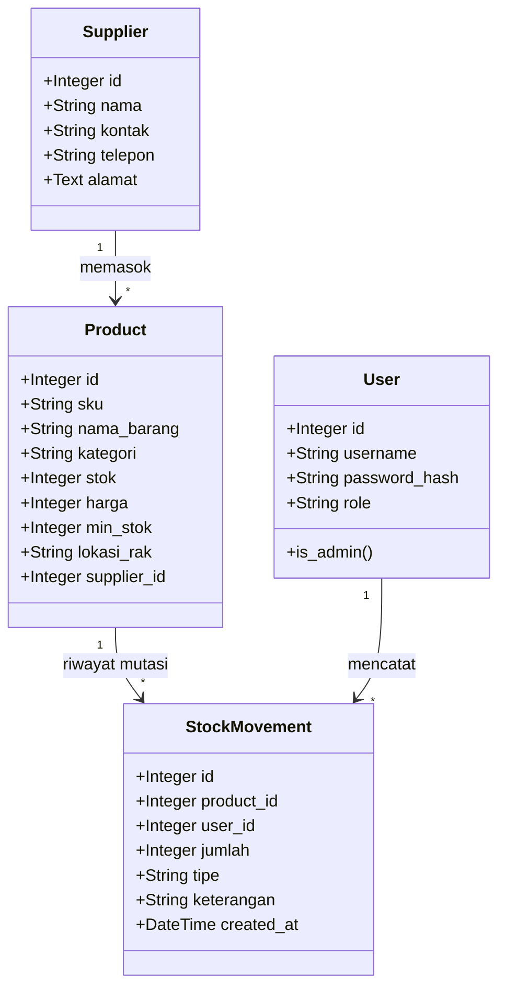

<div align="center">
  
  
  # 🌌 ZenithStock Enterprise
  
  ### *Platform Sistem Informasi Manajemen Logistik & Inventaris Barang Pergudangan Modern*
  
  ---
  
  [](#)
  [](#)
  [](#)
  [](#)
  [](#)
  
</div>

---

## 📖 Analisis Kasus & Penjelasan Umum

Dalam operasional rantai pasok (*supply chain*) gudang logistik skala besar, **pengendalian stok** adalah jantung operasional yang rawan terhadap inefisiensi dan kecurangan. ZenithStock Enterprise dirancang secara khusus untuk mengatasi masalah-masalah pergudangan kritis:

* **Pencegahan Penyusutan Barang (Asset Shrinkage):** Menghentikan kehilangan barang akibat tidak adanya pencatatan transaksi yang permanen dengan mengotomatisasi log mutasi yang bersifat *immutable* (tidak dapat diubah).
* **Validasi Integritas Kode Identitas (SKU):** Mencegah duplikasi data inventaris dengan filter validasi keunikan SKU (*Stock Keeping Unit*) di level form dan database.
* **Pembatasan Hak Otoritas:** Mencegah modifikasi data harga atau penghapusan barang oleh staff operasional melalui pembatasan akses berbasis peran (*Role-Based Access Control*).
* **Agregasi Nilai Aset Real-Time:** Memberikan informasi valuasi aset gudang yang akurat (Kuantitas × Harga Beli) secara instan melalui dashboard grafik analitik.

---

## 🛠️ Arsitektur & Struktur Folder Project

Aplikasi ini mengadopsi pola desain **MVC (Model-View-Controller)** yang modular menggunakan **Flask Blueprint** untuk memisahkan tanggung jawab kode program.

| Berkas / Direktori | Tipe | Fungsi & Deskripsi Peran dalam Sistem |
| :--- | :---: | :--- |
| `app.py` | File | Entry point utama aplikasi untuk memuat konfigurasi dan menjalankan server web Flask lokal. |
| `seed_all.py` | File | Script utilitas data seeder untuk menginisialisasi database dengan data uji coba logistik yang melimpah. |
| `requirements.txt` | File | Daftar dependensi modul Python yang dibutuhkan untuk menjalankan sistem. |
| `zenithstock/models.py` | File | Layer Data (OOP): Berisi deklarasi kelas ORM SQLAlchemy untuk memetakan tabel database. |
| `zenithstock/forms.py` | File | Layer Validasi: Berisi deklarasi kelas WTForms untuk memproses penyaringan masukan data formulir. |
| `zenithstock/routes/` | Folder | Layer Controller: Kumpulan blueprint Flask yang menangani alur routing dan logika bisnis. |
| `zenithstock/templates/` | Folder | Layer View: Berbasis Jinja2 template untuk menyajikan halaman antarmuka pengguna (UI). |
| `zenithstock/static/` | Folder | Aset Statis: Berisi master stylesheet kustom (`style.css`), berkas logo, dan background. |
| `instance/zenithstock.db` | File | Database SQLite lokal yang menampung seluruh tabel data relasional terintegrasi. |

---

## 💎 Penjelasan Detail Implementasi Sistem

ZenithStock Enterprise dibangun dengan mengintegrasikan berbagai teknologi mutakhir dalam pengembangan aplikasi web:

### 🌐 Routing & Blueprint Flask
Untuk menghindari penulisan rute yang menumpuk di satu berkas, aplikasi dibagi menjadi beberapa **Blueprint** modular:
* **Auth BP (`routes/auth.py`):** Menangani rute beranda (`/`), masuk (`/login`), daftar (`/register`), dan keluar (`/logout`).
* **Dashboard BP (`routes/dashboard.py`):** Mengelola tabel inventaris utama (`/dashboard`) dan CRUD produk.
* **Movements BP (`routes/movements.py`):** Mengelola pencatatan transaksi mutasi masuk dan keluar barang.
* **Suppliers BP (`routes/suppliers.py`):** Menangani CRUD database mitra pemasok.
* **Analytics BP (`routes/analytics.py`):** Memproses visualisasi statistik grafik kinerja gudang.
* **Audit BP (`routes/audit.py`):** Menampilkan log audit trail transaksi historis secara detail.

> [!NOTE]
> Rute web menggunakan method **GET** untuk me-render halaman UI dan **POST** untuk mengirimkan data sensitif (misal password, penambahan barang) ke database secara aman.

---

### 🎨 Tampilan Dinamis (Template Engine Jinja2)
Jinja2 digunakan untuk menyajikan halaman web dinamis dengan performa tinggi dan struktur kode yang kering (*Don't Repeat Yourself - DRY*):
* **Pewarisan Layout (`base.html`):** Berisi kerangka dasar HTML, menu sidebar, header topbar, dan penampung Toast Flash message. Halaman anak cukup memanggil ``.
* **Block System:** Bagian isi konten halaman anak didefinisikan secara modular di dalam `` dan akan di-render otomatis ke dalam template induk.
* **Kondisional & Loop Dinamis:** Data dari database dievaluasi secara dinamis menggunakan kondisional ``, perulangan ``, dan format filter angka Rupiah pada template.

---

### 🔒 Keamanan Formulir (Form Handling & Validation)
Masukan data dari pengguna disaring dengan sistem pengamanan 3 lapis sebelum dapat dieksekusi:
* **Proteksi Token CSRF:** Modul `Flask-WTF` secara otomatis menyematkan token CSRF terenkripsi pada setiap form untuk menangkal serangan pembajakan sesi.
* **Validasi Tipe Data:** Input untuk Stok dan Harga dipaksa berupa angka positif melalui validator WTForms (`IntegerField`, `DecimalField`, `NumberRange`).
* **Keunikan SKU & Username:** Sebelum record baru disimpan ke DB, sistem melakukan pencarian ke tabel untuk memastikan tidak ada duplikasi kode SKU atau nama pengguna.

---

### 💾 Relasi Data Objek (Database & SQLAlchemy ORM)
Pengelolaan database dikembangkan menggunakan basis **SQLAlchemy ORM** dengan model relasi terintegrasi:



#### Siklus Operasi CRUD & Mutasi Otomatis
* **Create (Tambah):** Menambahkan barang baru via `db.session.add(produk)`. Menambahkan barang baru dengan stok awal otomatis memicu pembuatan satu record log masuk (`MASUK`) di tabel `StockMovement` untuk menjaga akuntabilitas audit trail.
* **Read (Baca):** Menampilkan data secara instan (`Product.query.all()`) dilengkapi dengan pagination dinamis pada audit log dan pemfilteran live-search di dashboard.
* **Update (Ubah):** Mengubah detail harga, lokasi rak, atau stok produk. Jika stok diubah, sistem mencatat selisihnya sebagai tipe `PENYESUAIAN` di log mutasi secara otomatis.
* **Delete (Hapus):** Penghapusan produk (`db.session.delete(produk)`) hanya diizinkan untuk Admin dan secara otomatis menghapus riwayat mutasi terkait secara berantai (*cascade deletion*).

---

### 🛡️ Autentikasi & Otorisasi Hak Akses (RBAC)
* **Otentikasi (Siapa Anda):**
  * Password pengguna dienkripsi dengan hash aman menggunakan algoritma `pbkdf2:sha256` lewat modul `werkzeug.security`.
  * Login dikelola aman oleh `Flask-Login` via `login_user()`.
  * Pembatasan akses halaman non-login diimplementasikan menggunakan decorator `@login_required`.
* **Otorisasi / RBAC (Apa Hak Anda):**
  * Akun dibagi menjadi peran **Administrator (Admin)** dan **Staff**.
  * Akun Staff dibatasi dari mengakses halaman log audit trail penuh dan manajemen pengguna. Upaya akses URL ilegal secara sengaja akan dihadang dan memicu HTTP **403 Forbidden**.

---

## 🚀 Panduan Memulai Aplikasi

### 1. Instalasi Dependensi
Jalankan perintah berikut di folder proyek untuk menginstal modul Python:
```bash
pip install -r requirements.txt
```

### 2. Isi Data Uji Coba (Seeding)
Jalankan script seeder untuk membersihkan database lama dan mengisinya dengan data uji pergudangan yang melimpah secara otomatis:
```bash
python seed_all.py
```

### 3. Jalankan Aplikasi
Jalankan server lokal Flask:
```bash
python app.py
```
Akses sistem di browser Anda melalui alamat **[http://127.0.0.1:5000/](http://127.0.0.1:5000/)**.

---

## 👥 Pengembang Utama (Developer)

Sistem informasi logistik ZenithStock Enterprise dirancang dan dikembangkan sepenuhnya oleh:

* **Developer:** Gempur Budi Anarki
